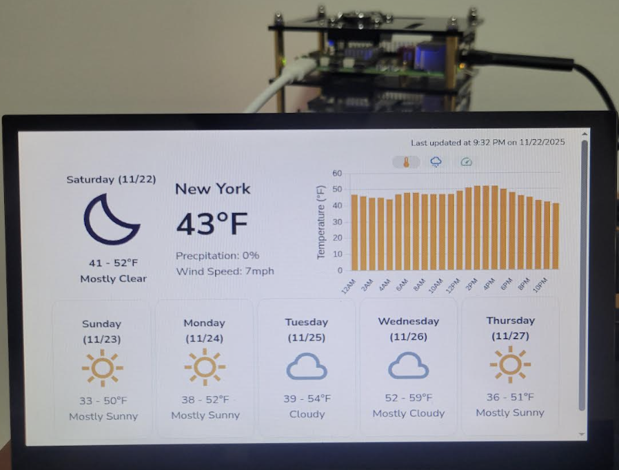

# Fullstack Raspberry Pi Weather Display 🌦️

A distributed fullstack weather display system built across three Raspberry Pis. The project fetches live weather data from the [National Weather Service](https://www.weather.gov/documentation/services-web-api), processes and enriches it using machine learning models, stores it in a database, and displays it via a responsive web frontend accessible on a local network.

---

## What Did I Learn?

This project has taught me about the following skills and topics:
- Setting up a local computer network
- Building an ETL pipeline for weather data
- Experimenting with language models
- Hosting production-grade servers for backend and frontend
- Containerizing programs in Docker

---

## High-Level Architecture

The project is split across three Raspberry Pis that are each responsible for a specific layer of the architecture.

| Device | Responsibility | Frameworks and Tools |
|------|---------------|------|
| **Raspberry Pi 3** | Backend API & database | SQLite and FastAPI
| **Raspberry Pi 4** | Frontend web server | React, Vite, and nginx
| **Raspberry Pi 5** | Data ingestion & processing | Ollama

---

## Network Setup
All Raspberry Pis are connected via Ethernet through a managed switch for stable communication with low-latency.

---

## Raspberry Pi 3 – Backend API & Database

The Raspberry Pi 3 hosts the backend service responsible for storing and serving weather data.

### Features
- FastAPI application running on a `uvicorn` server
- Accepts:
  - `PUT` requests to store weather forecast data
  - `GET` requests to retrieve stored forecasts by date
- Stores data in a local SQLite database
- Uses Pydantic models to enforce data validation
- Fully containerized using Docker

### Types of Data Stored
- Hourly forecast description  
- Hourly temperature  
- Hourly precipitation  
- Hourly wind speed  
- Daytime and nighttime forecast summaries  

---

## Raspberry Pi 4 – Frontend Web Application

The Raspberry Pi 4 serves the frontend that displays weather data in a clean and compact dashboard.

### Features
- Hosted via an nginx web server
- Displays:
  - Current hour weather conditions
  - Current day’s hourly temperature, precipitation, and wind speed
  - Daytime forecast for the next 5 days
- Fully containerized using Docker

---

## Raspberry Pi 5 – Data Ingestion & Processing

The Raspberry Pi 5 is responsible for fetching, processing, and enriching weather data before it is stored.

### Features
- Fetches raw weather data from the **National Weather Service**
- Extracts the following data:
  - Hourly forecast description
  - Hourly temperature
  - Hourly precipitation
  - Hourly wind speed
  - Overall daytime and nighttime forecast summaries

### Weather Classification

Every weather forecast description is classified as one of the following labels: Partly Cloudy, Mostly Cloudy, Cloudy, Partly Clear, Mostly Clear, Clear, Partly Sunny, Mostly Sunny, Sunny, Fog, Hail, Rain, Snow, Thunderstorm, and Windy.

The overall daytime and nighttime forecast summaries from the **National Weather Service** can be relatively long, so they are classified using the **1B parameter Gemma 3 model** from Google. As for the hourly forecast descriptions, they are much shorter. They are embedded using a **335M parameter embedding model** from mixedbread.ai, then they are matched to the closest weather label via cosine similarity. Both the Gemma 3 model and embedding model are hosted locally via Ollama.

---